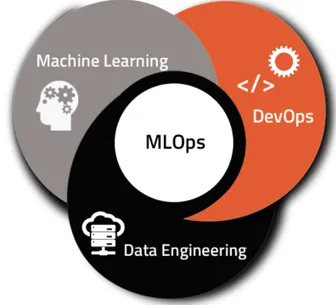

# <h1 align=center> **PROYECTO INDIVIDUAL** </h1>
# <h1 align=center>**`Machine Learning Operations (MLOps)`**</h1>

## <h2 align=center>**`Introducción y descripción del Proyecto`**</h2>

**¡Bienvenido/a a mi proyecto individual de Machine Learning Operations (MLOps)!**

En este proyecto, mi objetivo es llevar un modelo de recomendación que he desarrollado en un entorno de Data Science al mundo real, abordando los desafíos del ciclo de vida completo de un proyecto de Machine Learning.

Imaginate esto: Empezaste a trabajar como Data Scientist en Steam, una plataforma multinacional de videojuegos. El mundo es bello y vas a crear tu primer modelo de ML que soluciona un problema de negocio: Steam pide que te encargues de crear un sistema de recomendación de videojuegos para usuarios.

Vas a sus datos y te das cuenta que la madurez de los mismos es poca: Datos anidados, de tipo raw, no hay procesos automatizados para la actualización de nuevos productos, entre otras cosas… haciendo tu trabajo imposible.

## <h2 align=center>**`Proceso de Extracción, Transformación y Carga (ETL)`** </h2>

En el marco de este proyecto, se nos asignaron tareas específicas relacionadas con la manipulación de datos, las cuales formaron parte integral del proceso conocido como Extracción, Transformación y Carga (ETL). Para brindarte una comprensión más detallada de cómo se llevaron a cabo estas transformaciones, a continuación, te ofrecemos una breve sinopsis de las actividades realizadas:

+ Desanidamiento de campos: Algunos campos, como "reviews" y "genres", se encontraban anidados en el conjunto de datos. Implementamos un proceso de desanidamiento con el fin de desglosar estos campos y permitir su integración de manera más efectiva.

+ Normalización de formatos de fechas: Alineamos las fechas presentes en el conjunto de datos al formato AAAA-mm-dd para asegurar una mayor uniformidad. Además, creamos una nueva columna llamada "year" para extraer el año de la fecha de estreno.

+ Identificación y corrección de duplicados y formatos incorrectos: Llevamos a cabo una minuciosa revisión en busca de valores duplicados o con formatos incorrectos, aplicando las correcciones necesarias o eliminando los registros afectados.

+ Evaluación de la relevancia de las columnas y su eliminación, en caso de no ser útiles para la API o los modelos posteriores.

Estas acciones de transformación de datos desempeñaron un papel fundamental en la preparación del conjunto de datos, garantizando su adecuación para el análisis subsiguiente y su aplicación en el desarrollo del proyecto.

## <h2 align=center> **`Desarrollo de API`**</h2>

### En esta etapa del proyecto, se propone disponibilizar los datos de la empresa mediante el uso del framework FastAPI. Se han definido 6 funciones para los endpoints que serán consumidos en la API, cada una de ellas con un decorador `@app.get('/')`.
